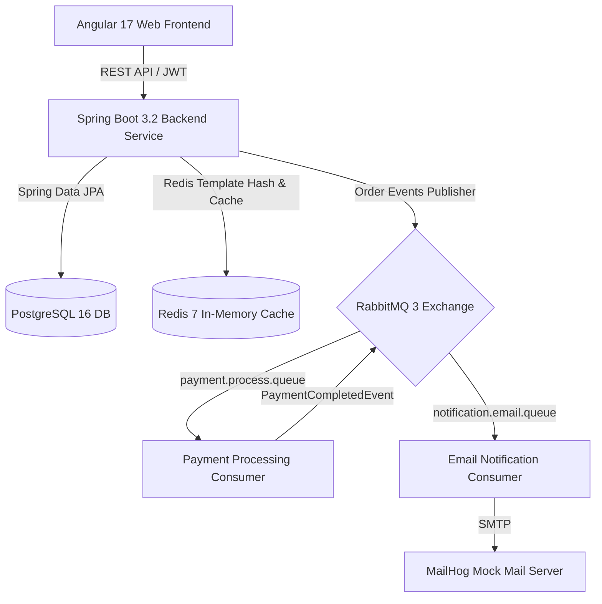
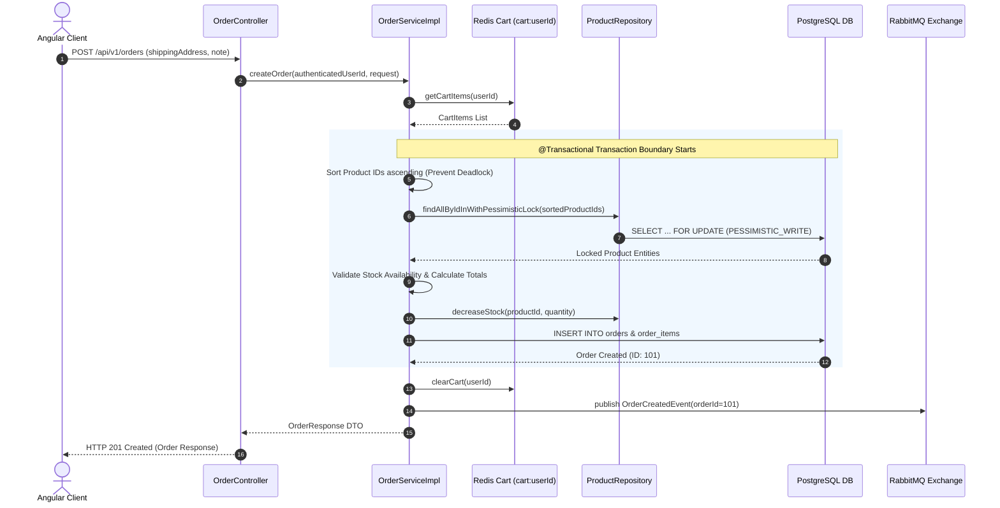
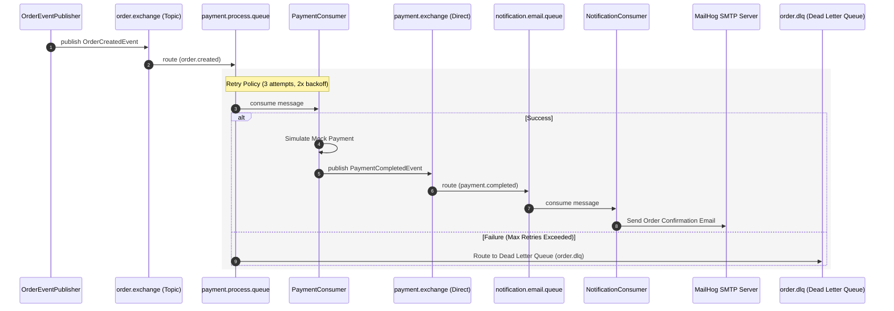
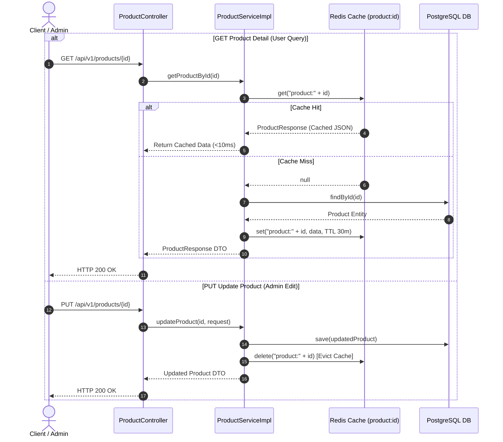
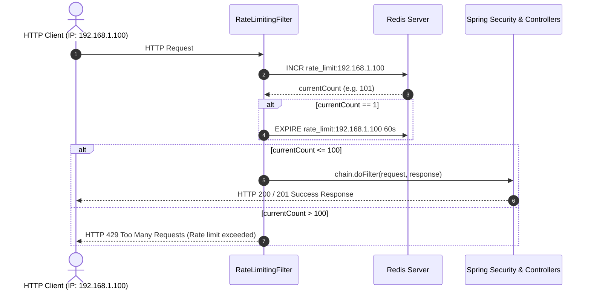
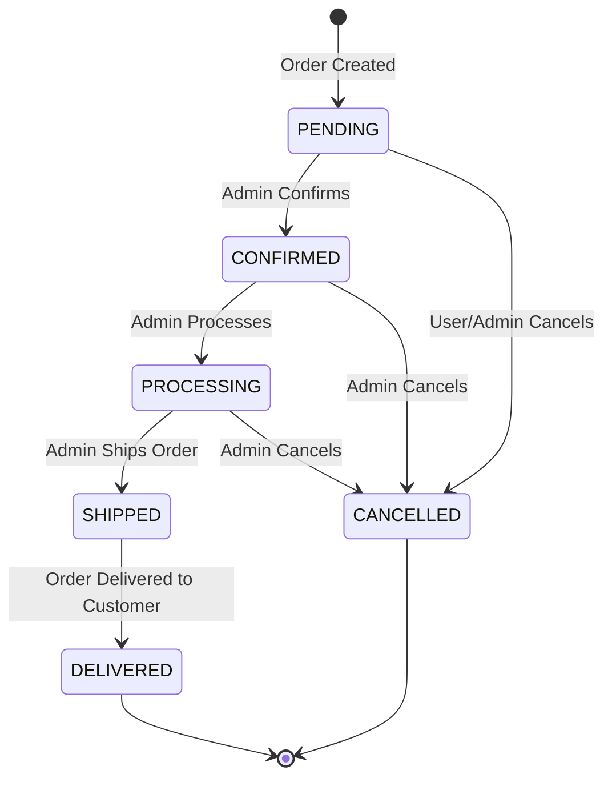
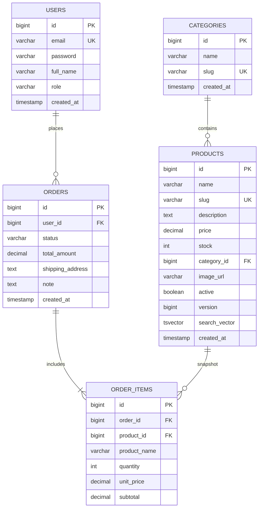
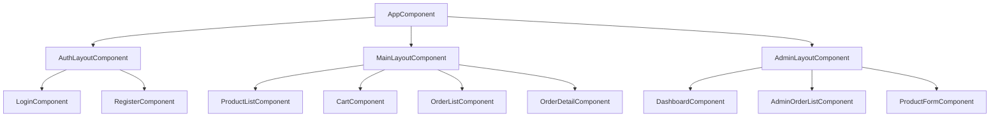

# OrderFlow — System Architecture & Design Specification

## 1. System Overview

**OrderFlow** is an enterprise-grade full-stack e-commerce order-processing platform designed for high performance, transactional consistency, and fault-tolerant asynchronous event processing.

---

## 2. Core Architectural Diagrams & Sequence Flows

### 2.1 Order Creation & Pessimistic Locking Sequence

This diagram illustrates the atomic `@Transactional` order placement flow with pessimistic lock (`PESSIMISTIC_WRITE`) sorted by Product ID to prevent deadlock and overselling under high concurrency.

---

### 2.2 Asynchronous Event Processing & Retry/DLQ Sequence

Order completion events trigger decoupled asynchronous workers for payment processing and email notifications via RabbitMQ.

---

### 2.3 Product Detail Redis Caching & Invalidation Flow

Product details are cached in Redis to achieve sub-10ms response times. Admin updates automatically trigger cache eviction.

---

### 2.4 API Rate Limiting Sequence (`RateLimitingFilter`)

Incoming requests pass through a Redis-backed sliding window rate limiter (max 100 requests per minute per IP).

---

### 2.5 Order Status Transition State Machine

Order status follows a strict validated state machine. Arbitrary transitions (e.g., direct jump from `PENDING` to `DELIVERED`) are rejected with `HTTP 400 Bad Request`.

---

## 3. Database Schema Specification

### 3.1 Core Tables & Relations

### 3.2 Index Strategy (Flyway Migration V4)
- `idx_products_category`: Fast lookup by category.
- `idx_products_active`: Partial index on active products.
- `idx_products_search`: GIN Index on `search_vector` for PostgreSQL Full-Text Search.
- `idx_orders_user_status`: Composite index for user order filtering.

---

## 4. Frontend Component Architecture (Angular 17)

---

## 5. Technology Stack Summary

| Layer | Technology | Purpose |
| :--- | :--- | :--- |
| **Backend Framework** | Java 17, Spring Boot 3.2.5 | Core API & Business logic service |
| **Database** | PostgreSQL 16 | Relational persistent database |
| **In-Memory Cache & Cart**| Redis 7 | Redis Hash Cart & Product Detail Caching |
| **Message Broker** | RabbitMQ 3 | Async Event-Driven architecture |
| **Mail Mock** | MailHog | SMTP email testing & inspection |
| **Frontend Framework** | Angular 17, TypeScript, Material | Responsive SPA Web Application |
| **Schema Migration** | Flyway 9 | Deterministic DB schema version control |
| **Documentation** | SpringDoc OpenAPI (Swagger) | Interactive REST API documentation |
