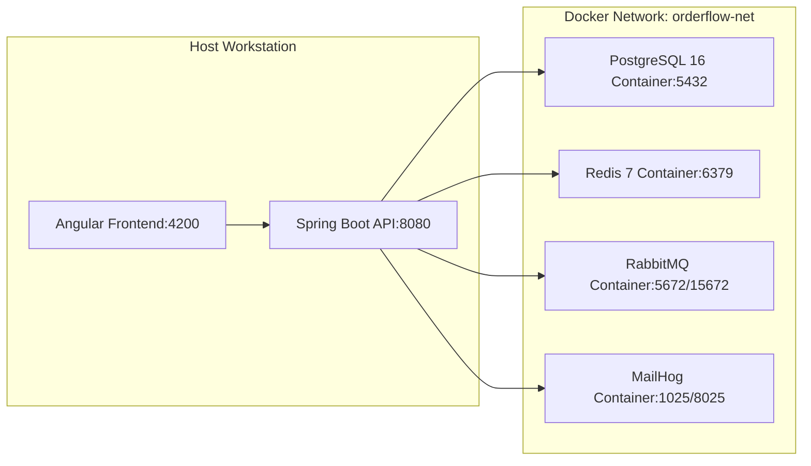

# OrderFlow — Deployment & Setup Guide

## 1. Local Environment Requirements

Before launching OrderFlow, ensure your local workstation meets the following prerequisites:

- **Java JDK**: 17 or higher
- **Build Tool**: Apache Maven 3.9+ (or use bundled `mvnw`)
- **Node.js**: 18+ and `npm`
- **Docker**: Docker Desktop 4.x+ with Docker Compose
- **Apache Bench (`ab`)**: Optional (for performance benchmark scripts)



---

## 2. Step-by-Step Setup Guide

### Step 1: Clone & Configure Environment Variables
Copy `.env.example` to `.env` if local overrides are needed:
```bash
cp .env.example .env
```

### Step 2: Start Infrastructure Containers
Launch PostgreSQL, Redis, RabbitMQ, and MailHog via Docker Compose:
```bash
cd backend
docker compose up -d
docker compose ps
```

Verify that all 4 containers are healthy:
- `training-postgres` (Port `5432`)
- `training-redis` (Port `6379`)
- `training-rabbitmq` (Ports `5672`, `15672`)
- `training-mailhog` (Ports `1025`, `8025`)

### Step 3: Run Backend Service
```bash
cd backend
./mvnw spring-boot:run
```
*Windows Command Prompt/PowerShell:*
```powershell
cd backend
.\mvnw.cmd spring-boot:run
```

- API Base URL: `http://localhost:8080`
- Swagger UI: `http://localhost:8080/swagger-ui.html`

### Step 4: Run Frontend Application
```bash
cd frontend
npm install
npm start
```

- Angular Application URL: `http://localhost:4200`

---

## 3. Running Verification & Performance Tests

### 3.1 Backend Test Suite
```bash
cd backend
./mvnw clean test
```

### 3.2 Apache Bench Performance Benchmark
Run the stress test script to evaluate latency SLA (< 200ms) and error rates (< 1%):
```powershell
.\scripts\run-stress-test.ps1 -BaseUrl "http://localhost:8080" -Requests 1000 -Concurrency 50
```

---

## 4. Service Port Mapping Reference

| Dịch vụ | Cổng Host | URL Quản trị / Giao diện | Tài khoản mặc định |
| :--- | :--- | :--- | :--- |
| **Spring Boot API** | `8080` | `http://localhost:8080/swagger-ui.html` | - |
| **Angular Web App** | `4200` | `http://localhost:4200` | `admin@example.com` / `Admin123!` |
| **PostgreSQL** | `5432` | `jdbc:postgresql://localhost:5432/training_db` | `postgres` / `postgres` |
| **Redis** | `6379` | `localhost:6379` | Không mật khẩu |
| **RabbitMQ** | `15672` | `http://localhost:15672` | `guest` / `guest` |
| **MailHog UI** | `8025` | `http://localhost:8025` | Không mật khẩu |
